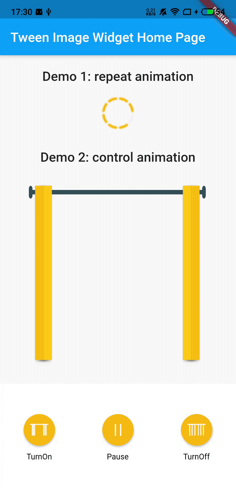

Language: [English](README.md) | [中文简体](README-ZH.md)
# tween_image_widget

A tween image widget Flutter package.

## Getting Started

### Add dependency

```yaml
dependencies:
  tween_image_widget: ^0.0.2 #please use the latest version on pub
```
 
### Use Widget
1. Use repeat animation
 Only need to pass in the image’s path and index, and the specific durationMilliseconds.
```dart
         TweenImageWidget(
              ImagesEntry(1, 8, "assets/img/addpage_icon_load%s.png"),
              durationMilliseconds: 500,
            ),
```

2. Use control animation
Need to assign repeat to false, define TweenImageWidget, and then use reverse(), forward(), stop() and other functions according to the scene
```dart
  @override
  void initState() {
    _curtainAnimationImage = TweenImageWidget(
      ImagesEntry(1, 20, "equipmentcontrol_pic_curtain%s".toAssetImg()),
      durationMilliseconds: 5000,
      repeat: false,
    );
    super.initState();
  }
```

3. Other used parameters (initial value, width, height)
```dart
///initial value:calculated by percentage
startsValue: curtainPosition / 100,
///Height and width are optional. Once assigned, the image will be scaled according to the value you specify
height: 50,
width: 50,
```

**Functions:**
```dart
  ///[repeat]'s default value is true, if need manually control the animation, please pass in false
  ///
  ///[startsValue] Is a starting state value, if want it to start from a few percent of the animation, please pass in this value
  ///
  ///[durationMilliseconds] is how many milliseconds the animation to run, the default value is 3000 milliseconds
  TweenImageWidget(
    this.entry, {
    this.width,
    this.height,
    this.durationMilliseconds = 3000,
    this.repeat = true,
    this.startsValue,
    key,
  }

  ///[lowIndex] is the first index of the animation sequence pictures
  /// [highIndex] is the last index of the animation sequence pictures
  /// [basePath] is the file path of the animation sequence pictures,example:"images/pic_animation%s.png"
  /// [makePath] is an optional file path constructor
  ImagesEntry(this.lowIndex, this.highIndex, this.basePath, [this.makePath]);

  
 ///Stops running this animation.
  stop({bool canceled = true});

  ///Starts running this animation forwards (towards the end).
  forward({double? from});

  ///Starts running this animation in reverse (towards the beginning).
  reverse({double? from});

  ///Drives the animation from its current value to target.
  animateToTarget(double target, {Duration? duration});
```

### Example:

```dart
 bool isDoorOpen = true;
  TweenImageWidget _doorAnimationImage;

  @override
  void initState() {
    _doorAnimationImage = TweenImageWidget(ImagesEntry(1, 4, "images/equipmentcontrol_pic_door%s"),
        durationMilliseconds: 600, repeat: false, startsValue: isDoorOpen ? 1 : 0);
    super.initState();
  }

  @override
  Widget build(BuildContext context) {
    return Column(
      children: [
        Expanded(child: _doorAnimationImage),
        Column(
          children: [
            Row(
              mainAxisAlignment: MainAxisAlignment.spaceAround,
              children: [
                InkWell(
                  child: Text("Lock"),
                  onTap: () {
                    _doorAnimationImage.stop();
                    _doorAnimationImage.reverse();
                  },
                ),
                InkWell(
                  child: Text("Unlock"),
                  onTap: () {
                    _doorAnimationImage.stop();
                    _doorAnimationImage.forward();
                  },
                ),
              ],
            ),
          ],
        )
      ],
    );
  }
```

#### Demo Pictrue



